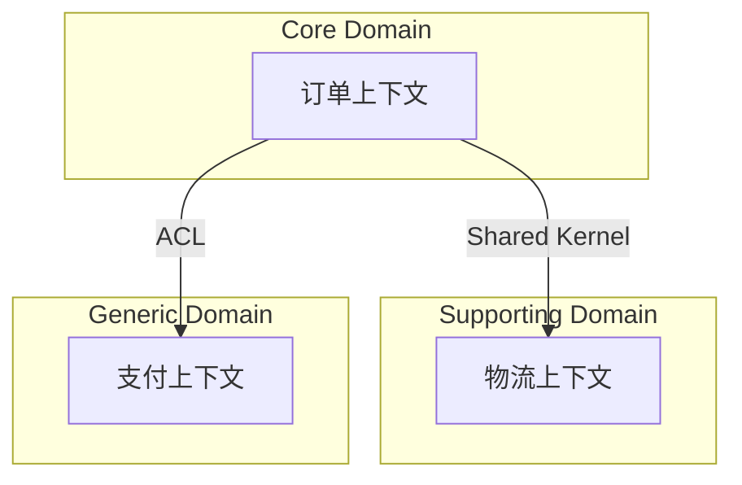
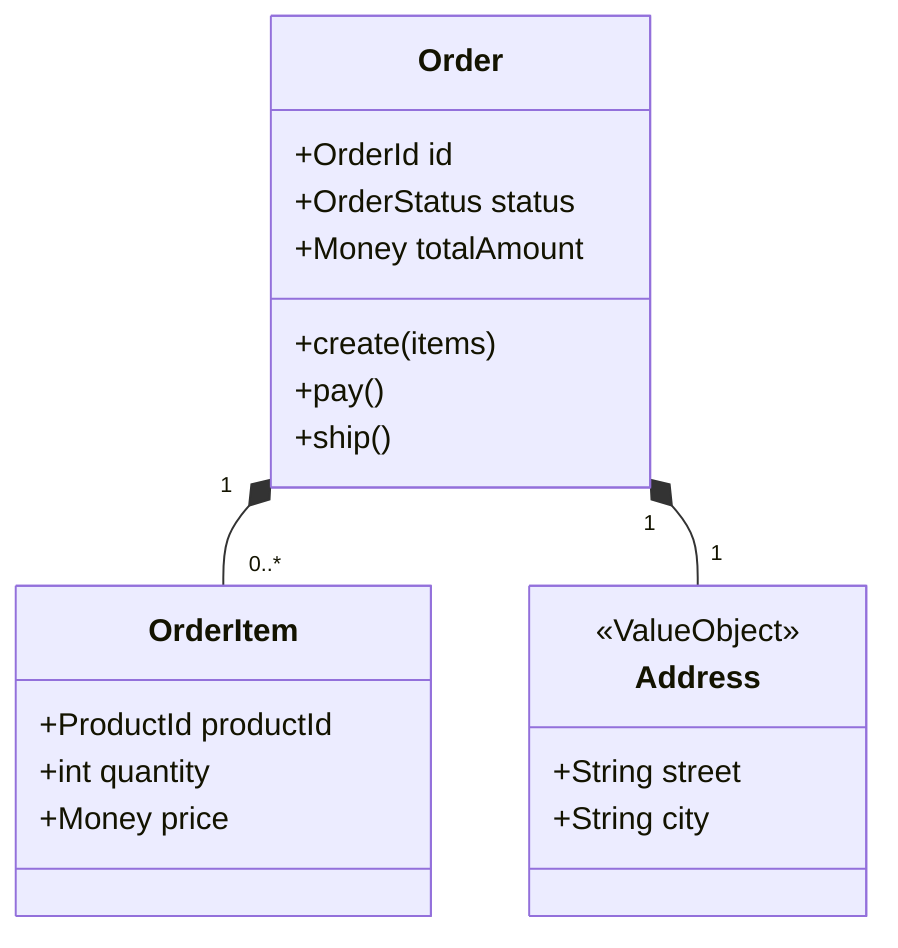
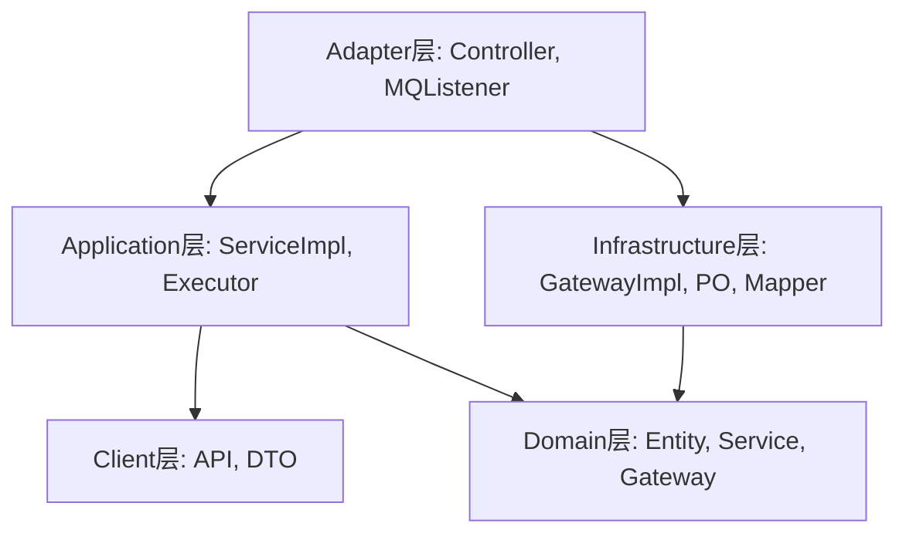

# DDD 建模子工作流

<workflow>

<critical>此工作流执行详细的 DDD 领域建模（阶段 3）</critical>
<critical>调用者: ../JL-Design-DDD/instructions.md 路由器</critical>
<critical>处理: ddd_modeling 阶段</critical>
<critical>原则: 必须生成高质量的可视化图表和完整的文件结构</critical>

<step n="3.1" goal="加载上下文和前序产物">

<action>加载以下资源：
- {inputs.output_dir}/Requirements_Design_*.md (产研设计)
- {inputs.output_dir}/DDD_Design_*.md (事件风暴结果)
- {templates.ddd_template}
- Java编码规范.md (来自知识库，**重要参考**)
</action>

<check if="resume_mode == true">
  <action>加载之前的建模进度</action>
</check>

<output>**DDD 建模准备就绪 ✓**

已加载前序设计文档及**Java编码规范**。本阶段将完成详细的领域建模。

我们将依次完成：
1. 限界上下文映射 (Context Map)
2. 聚合根与实体详细设计 (Class Diagram)
3. 架构分层设计 (COLA)
4. 工程目录结构生成 (File Tree) - **将严格遵守 Java 编码规范**

请确认开始？[y/n]</output>

<action>等待用户确认</action>
<check if="用户确认">
  <action>继续到步骤 3.2</action>
</check>

</step>

<step n="3.2" goal="限界上下文与领域划分">

<action>细化限界上下文划分</action>
<action>识别上下文之间的映射关系 (Shared Kernel, ACL, Customer-Supplier 等)</action>
<action>生成 Mermaid 关系图</action>

<output>**步骤 1/4: 限界上下文映射**



请确认上下文划分及关系是否准确？[确认通过 / 修改意见]</output>

<action>等待用户确认</action>
<loop while="用户有修改意见">
  <action>调整上下文映射</action>
  <output>**更新后的映射图**... 是否确认？[y/n]</output>
  <action>等待用户确认</action>
</loop>

</step>

<step n="3.3" goal="聚合根与实体详细设计">
<critical>必须生成包含属性和方法的详细类图</critical>

<action>为每个核心聚合生成 Mermaid 类图</action>
<action>包含：聚合根、实体、值对象、枚举</action>
<action>标注：属性、关键行为方法、可见性</action>

<output>**步骤 2/4: 核心聚合类图**

**OrderAggregate 类图**:


请仔细检查：
1. 属性是否完整？
2. 方法名是否准确反映业务行为？
3. 实体间关系是否正确？

[确认通过 / 修改类图]</output>

<action>等待用户确认</action>
<loop while="用户有修改意见">
  <action>调整类图</action>
  <output>**更新后的类图**... 是否确认？[y/n]</output>
  <action>等待用户确认</action>
</loop>

</step>

<step n="3.4" goal="应用架构与分层设计 (COLA)">

<action>基于 COLA 架构规范设计应用分层</action>
<action>参考 `Java编码规范.md` 中的“目录结构”和“如何分包”章节</action>

<output>**步骤 3/4: 应用架构设计**

我们将采用符合 **Java编码规范** 的 COLA 架构。

**分层依赖关系**:


是否确认使用此架构规范？[y/n]</output>

<action>等待用户确认</action>

</step>

<step n="3.5" goal="生成工程目录结构">
<critical>必须生成完整的、包含关键类文件的目录树，且严格遵守 Java 编码规范</critical>

<action>生成完整的工程目录结构 (ASCII Tree)</action>
<action>严格遵循 `Java编码规范.md` 中的命名和分包规则：
1. **分层结构**: adapter, client, application, domain, infrastructure
2. **Domain层**: 按业务域聚合 (`domain.{biz}.model`), 包含 `aggregate`, `entity`, `valobj`, `cmd`
3. **类名规范**:
   - 实现类后缀 `Impl` (e.g. `OrderServiceImpl`)
   - 仓储接口 `Gateway`, 实现 `GatewayImpl`
   - 持久化对象 `PO`
   - 控制器 `Controller`
</action>

<output>**步骤 4/4: 工程目录结构**

```text
com.jlpay.order
├── adapter
│   └── order
│       └── OrderController.java           # Web接口适配器
├── client
│   └── order
│       ├── api
│       │   └── OrderApi.java              # 外部服务接口
│       └── dto
│           ├── request
│           │   └── OrderCreateRequest.java
│           └── response
│               └── OrderResponse.java
├── application
│   └── order
│       ├── OrderApiImpl.java              # Client接口实现
│       └── executor
│           ├── OrderCreateCmdExe.java     # 命令执行器
│           └── query
│               └── OrderListQueryExe.java # 查询执行器
├── domain
│   └── order
│       ├── model
│       │   ├── aggregate
│       │   │   └── Order.java             # 聚合根
│       │   ├── entity
│       │   │   └── OrderItem.java         # 实体
│       │   ├── value
│       │   │   └── Address.java           # 值对象
│       │   └── cmd
│       │       └── OrderPayCmd.java       # 领域命令
│       ├── gateway
│       │   └── OrderGateway.java          # 仓储接口
│       └── service
│           └── OrderDomainService.java    # 领域服务接口
├── infrastructure
│   └── order
│       ├── PO
│       │   └── OrderPO.java               # 持久化对象
│       ├── gateway
│       │   └── OrderGatewayImpl.java      # 仓储实现
│       └── mapper
│           └── OrderMapper.java           # MyBatis Mapper
└── common
    └── config
        └── SwaggerConfig.java
```

请确认目录结构、包名和类命名是否严格符合规范？[确认通过 / 修改结构]</output>

<action>等待用户确认</action>
<loop while="用户有修改意见">
  <action>调整目录结构</action>
  <output>**更新后的目录结构**... 是否确认？[y/n]</output>
  <action>等待用户确认</action>
</loop>

</step>

<step n="3.6" goal="生成并保存最终报告">

<action>整合所有图表、类设计、目录结构到 DDD 建模报告中</action>
<action>执行自我审阅：
- 检查 Mermaid 类图完整性
- 检查文件树是否符合 Java 编码规范
- 检查与前序文档的一致性
</action>

<output>**建模完成！文档生成中...**

**文档包含**:
- 限界上下文映射图 (Mermaid)
- 核心聚合类图 (Mermaid)
- 应用架构图 (Mermaid)
- 完整工程目录树 (ASCII) - 已对齐编码规范
- 领域服务与网关定义

准备保存最终报告。确认保存？[y/n]</output>

<action>等待用户确认</action>

<check if="用户确认">
  <action>生成时间戳: {{timestamp}}</action>
  <action>保存文档到: {inputs.output_dir}/DDD_Design_{{timestamp}}.md</action>
  <action>验证文档保存成功</action>

  <action>更新状态文件:
  - 添加到 completed_phases: {"phase": "ddd_modeling", "status": "completed", "timestamp": "{{now}}", "output": "DDD_Design_{{timestamp}}.md"}
  - 更新 current_phase = "completed"
  - 更新 timestamps.completed = "{{now}}"
  </action>

  <output>**✓ DDD 建模报告已保存**
  
  文件位置: {inputs.output_dir}/DDD_Design_{{timestamp}}.md
  
  **🎉 恭喜！DDD 系统设计工作流全部完成。**
  
  后续您可以：
  1. 使用 IDE 插件基于 PlantUML/Mermaid 生成代码骨架
  2. 使用 `JL-Build-ReviewCode` 审查后续实现代码
  </output>

  <action>设置 ddd_modeling_completed = true</action>
  <action>返回主工作流路由器完成流程</action>
</check>

</step>

</workflow>
