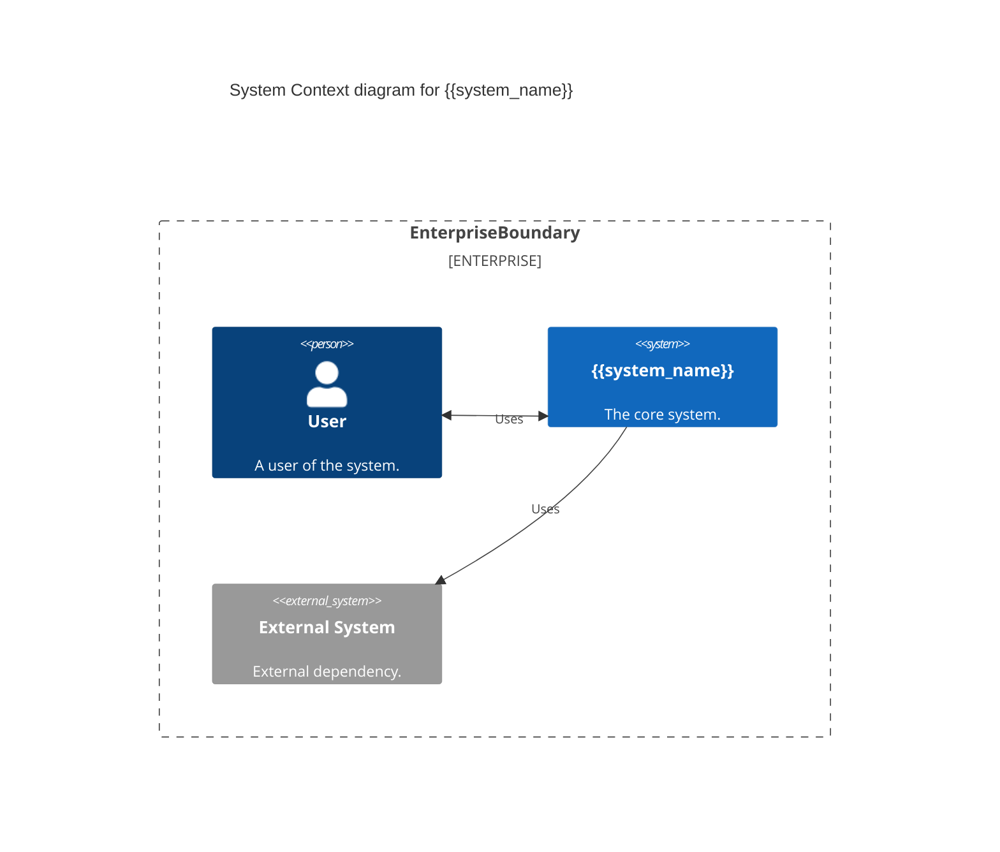
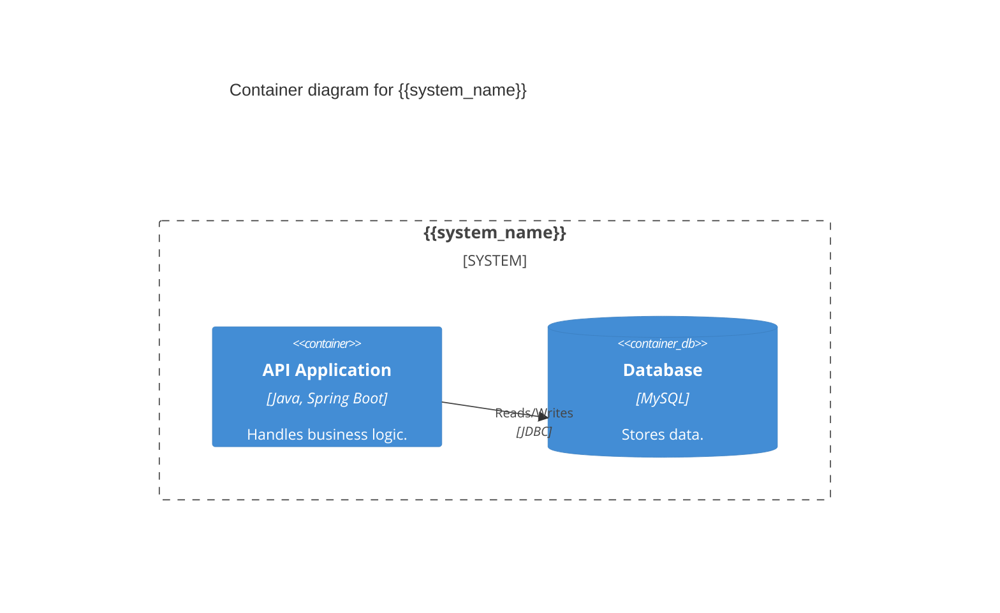

# 产研统一设计子工作流

<workflow>

<critical>此工作流执行产研统一设计文档生成（阶段 1）</critical>
<critical>调用者: ../JL-Design-DDD/instructions.md 路由器</critical>
<critical>处理: requirements_design 阶段</critical>
<critical>原则: 每一步必须等待用户确认后才能进入下一步。严禁一次性生成所有内容。</critical>

<step n="1.1" goal="加载上下文资源">

<action>加载以下资源：
- 当前的上下文
- 用户的补充输入
- {inputs.req_path} 需求描述文档
- {templates.requirements_template} 产研通用需求设计文档模板
</action>

<check if="resume_mode == true">
  <action>加载之前的设计进度</action>
  <action>显示: "检测到之前的设计进度，将从上次中断处继续..."</action>
  <action>跳转到相应的步骤</action>
</check>

<action>评估资源内容是否足够，可以明确需求的边界和范围</action>

<check if="包含足够的需求信息">
  <output>**资源加载完成 ✓**

我已阅读并理解以下内容：
- 需求文档: {{req_doc_summary}}
- 业务背景: {{business_context_summary}}
- 核心功能: {{core_features_summary}}

我已准备好开始产研设计。请确认是否继续？[y/n]</output>
</check>

<check if="需求信息不足">
  <output>**需求信息不足 ⚠️**

当前可用信息：
{{available_info_summary}}

缺失的关键信息：
{{missing_info_list}}

请提供以下内容之一：
1. 完整的 PRD 文档路径
2. 需求描述文本
3. 相关代码路径（用于分析现有实现）

或者使用 BMAD 流程先完成 PRD 文档。</output>
  <action>等待用户输入</action>
</check>

</step>

<step n="1.2" goal="等待用户确认需求">

<action>等待用户确认或补充信息</action>

<check if="用户提供了额外信息">
  <action>整合新信息到上下文中</action>
  <action>更新 {{context_summary}}</action>
</check>

<check if="用户确认继续">
  <action>继续到步骤 1.3</action>
</check>

</step>

<step n="1.3" goal="生成数据字典">
<critical>优先提取数据字典，这是后续所有内容的基础</critical>

<action>从需求文档中提取所有业务和技术术语</action>
<action>创建数据字典，使用 Markdown 表格展示：
| 术语 | 含义 | 属性名称 | 备注 |
|-----|------|---------|-----|
</action>

<output>**步骤 1/5: 数据字典确认**

为了确保术语一致性，我提取了以下关键术语：

{{data_dictionary_table}}

请确认：
1. 术语定义是否准确？
2. 是否有遗漏的关键概念？

[确认通过 / 修改意见]</output>

<action>等待用户确认</action>

<loop while="用户有修改意见">
  <action>根据反馈更新数据字典</action>
  <output>**更新后的数据字典**... 是否确认？[y/继续修改]</output>
  <action>等待用户确认</action>
</loop>

</step>

<step n="1.4" goal="生成业务规则">

<action>提取所有业务规则并分类汇总</action>
<action>使用 Markdown 表格展示，按功能模块分组：

### 模块 A
| 规则ID | 规则名称 | 描述 | 约束条件 |
|-------|---------|-----|---------|
</action>

<output>**步骤 2/5: 业务规则确认**

我识别了以下核心业务规则：

{{business_rules_tables}}

请确认规则是否完整且无歧义？[确认通过 / 修改意见]</output>

<action>等待用户确认</action>

<loop while="用户有修改意见">
  <action>根据反馈更新业务规则</action>
  <output>**更新后的业务规则**... 是否确认？[y/继续修改]</output>
  <action>等待用户确认</action>
</loop>

</step>

<step n="1.5" goal="可视化业务流程">
<critical>必须使用 Mermaid 生成清晰的流程图</critical>

<action>绘制主业务流程图 (Mermaid flowchart TD)</action>
<action>绘制关键状态流转图 (Mermaid stateDiagram-v2)</action>
<action>绘制核心交互时序图 (Mermaid sequenceDiagram)</action>

<output>**步骤 3/5: 业务流程可视化**

**主业务流程图**:
```mermaid
{{main_flow_diagram}}
```

**关键实体状态流转**:
```mermaid
{{state_diagram}}
```

**核心场景时序图**:
```mermaid
{{sequence_diagram}}
```

请检查图表逻辑是否正确反映了业务流转？[确认通过 / 修改图表]</output>

<action>等待用户确认</action>

<loop while="用户要求修改">
  <action>根据反馈调整 Mermaid 代码</action>
  <output>**更新后的图表**...
  ```mermaid
  {{updated_diagram}}
  ```
  是否满意？[y/继续修改]</output>
  <action>等待用户确认</action>
</loop>

</step>

<step n="1.6" goal="系统架构与上下文 (C4)">

<action>分析系统上下文，绘制 C4 Context 图（必须使用 Mermaid C4Context 语法）</action>
<action>分析容器结构，绘制 C4 Container 图（必须使用 Mermaid C4Container 语法）</action>

<output>**步骤 4/5: 系统架构视图 (C4)**

**System Context (系统上下文)**:


**Container (容器视图)**:


请确认系统边界和外部依赖关系是否准确？[确认通过 / 修改架构]</output>

<action>等待用户确认</action>

<loop while="用户要求修改">
  <action>调整 C4 图表</action>
  <output>**更新后的架构图**... 是否确认？[y/继续修改]</output>
  <action>等待用户确认</action>
</loop>

</step>

<step n="1.7" goal="生成并保存完整文档">

<action>整合数据字典、业务规则、图表、功能清单生成完整文档</action>
<action>执行自我审阅（Post-Check）：
- 检查 Mermaid 图表语法
- 检查图文一致性
- 检查文档结构完整性
</action>

<output>**步骤 5/5: 文档生成与保存**

产研统一设计文档已整合完毕。

**文档结构预览**:
{{document_structure_preview}}

**包含图表**:
- 流程图: {{flowchart_count}}
- 状态图: {{state_diagram_count}}
- 时序图: {{sequence_diagram_count}}
- C4架构图: 2

准备保存文档。确认保存？[y/n]</output>

<action>等待用户确认</action>

<check if="用户确认">
  <action>生成时间戳: {{timestamp}}</action>
  <action>保存文档到: {inputs.output_dir}/Requirements_Design_{{timestamp}}.md</action>
  <action>验证文档保存成功</action>

  <action>更新状态文件:
  - 添加到 completed_phases: {"phase": "requirements_design_doc", "status": "completed", "timestamp": "{{now}}", "output": "Requirements_Design_{{timestamp}}.md"}
  - 更新 last_updated 时间戳
  </action>

  <output>**✓ 产研统一设计文档已保存**
  
  文件位置: {inputs.output_dir}/Requirements_Design_{{timestamp}}.md
  
  即将进入事件风暴阶段。</output>

  <action>设置 requirements_design_completed = true</action>
  <action>返回主工作流路由器继续下一阶段</action>
</check>

</step>

</workflow>
