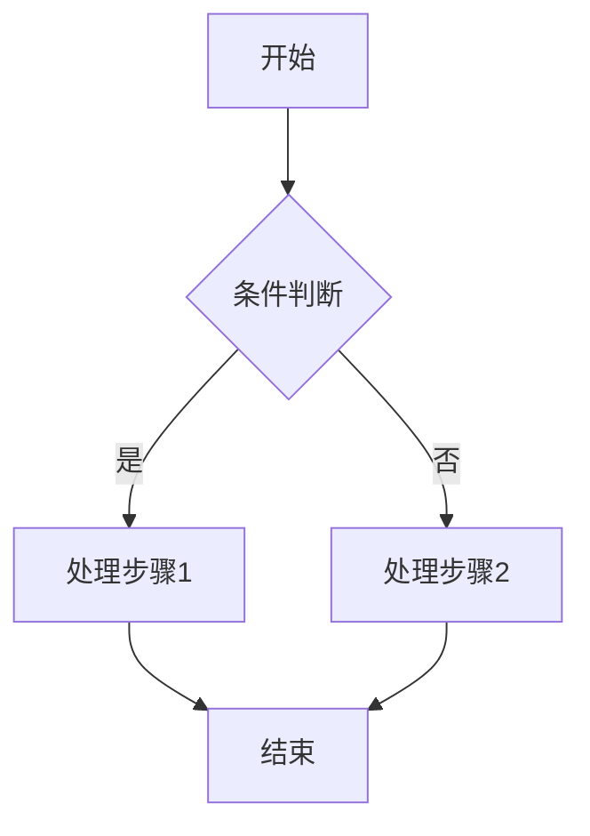
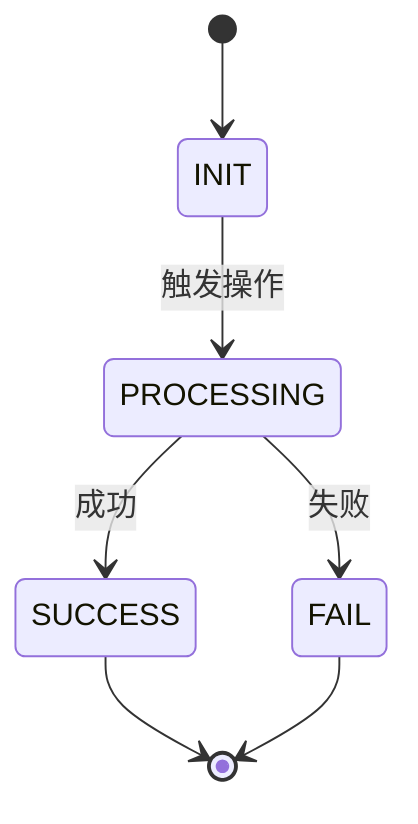

# 代码分析子工作流

<critical>此子工作流由父工作流 JL-Ship-AnalyzeCode 调用</critical>
<critical>您必须已经加载: {parent_path}/workflow.yaml</critical>
<critical>您必须已经完成: 上下文分析阶段</critical>
<critical>所有响应使用 {communication_language} 进行沟通</critical>

<workflow phase="code_analysis">

<step n="1" goal="加载分析模板和上下文">

<action>加载分析报告模板: {templates.analyze_template}</action>
<action>加载上下文分析结果: {{context_summary}}</action>

<action>准备分析维度（基于用户角色 {{user_role}}）:
- 通用维度: 业务背景、业务流程、业务规则、数据接口、异常边界
- 角色特定维度: {{focus_areas}}
</action>

<output>**开始深度代码分析**

分析目标: {{analysis_target}}
用户角色: {{user_role}}
重点关注: {{focus_areas}}

正在分析中，请稍候...</output>

</step>

<step n="2" goal="业务背景与目标分析">

<action>基于代码分析，推断业务背景</action>

<action>提取以下信息:
- **User Story**: 从代码功能推断用户故事
  - 格式: 作为一个[角色]，我希望[做什么操作]，以便于[达到什么目的]
- **核心价值**: 这段代码解决了什么业务问题
- **涉及模块**: 代码所属的业务模块
</action>

<check if="有相关文档">
  <action>对照相关文档验证推断是否正确</action>
  <action>如有差异，以文档为准并标注</action>
</check>

<action>存储业务背景分析结果为 {{business_context}}</action>

</step>

<step n="3" goal="业务流程分析">

<action>分析代码中的业务流程</action>

<action>识别主业务流程:
- 入口方法和触发条件
- 处理步骤序列
- 关键判断分支
- 输出结果
</action>

<action>使用 Mermaid 绘制流程图:

</action>

<action>详细描述流程步骤:
1. 用户操作 -> 系统响应
2. 正常路径（Happy Path）
3. 分支路径和条件
</action>

<action>存储流程分析结果为 {{business_flows}}</action>

</step>

<step n="4" goal="业务规则分析">

<action>提取代码中的业务规则</action>

<action>分析前置校验规则:
| 字段/对象 | 校验规则 | 错误提示 | 备注 |
|----------|---------|---------|------|
| field1   | 规则描述 | 错误信息 | 说明 |
</action>

<action>分析核心处理逻辑:
- 使用伪代码或逻辑描述
- 不写具体代码，写业务逻辑
- 标注关键计算公式
- 说明数据转换规则
</action>

<action>分析状态流转（如有）:
- 识别状态枚举
- 绘制状态流转图

- 创建状态流转表格:
| 起始状态 | 触发动作 | 结束状态 | 触发条件 |
|---------|---------|---------|---------|
</action>

<action>存储业务规则分析结果为 {{business_rules}}</action>
<action>存储状态机分析结果为 {{state_machines}}</action>

</step>

<step n="5" goal="数据与接口分析">

<action>分析数据模型</action>

<action>识别数据库表和字段:
- 新增/修改的表
- 关键字段说明
- 索引设计
- 关联关系
</action>

<action>分析接口定义:
- 接口名称和路径
- 请求方式 (GET/POST/PUT/DELETE)
- 入参定义 (JSON Schema)
- 出参定义 (JSON Schema)
- 示例请求和响应
</action>

<action>分析外部依赖:
- 依赖的内部服务
- 依赖的第三方接口
- 依赖的中间件（MQ、Redis、ES 等）
- 依赖的数据库
</action>

<action>存储外部依赖分析结果为 {{external_dependencies}}</action>

</step>

<step n="6" goal="异常与边界分析">

<action>分析异常处理</action>

<action>识别异常场景:
| 场景 | 处理方案 | 是否需要人工介入 |
|-----|---------|----------------|
| 网络超时 | 重试机制/熔断 | 否 |
| 数据不存在 | 返回错误码 | 否 |
| 并发冲突 | 分布式锁/乐观锁 | 否 |
| 业务异常 | 事务回滚 | 视情况 |
</action>

<action>分析边界条件:
- 空值处理
- 边界值处理
- 并发处理
- 幂等性设计
</action>

<action>识别潜在风险点:
- 性能瓶颈
- 安全隐患
- 数据一致性风险
</action>

</step>

<step n="7" goal="角色特定分析" if="user_role != generic">

<check if="user_role == developer">
  <action>补充开发人员关注点:
  - 代码逻辑推演细节
  - 数据流转完整路径
  - 性能优化建议
  - 可重构点识别
  </action>
</check>

<check if="user_role == architect">
  <action>补充架构师关注点:
  - 架构模式识别（MVC/DDD/CQRS 等）
  - 模块职责是否单一
  - 系统集成点评估
  - 扩展性分析
  </action>
</check>

<check if="user_role == tester">
  <action>补充测试人员关注点:
  - 测试覆盖点清单
  - 边界测试建议
  - 异常场景测试点
  - 验收标准建议
  </action>
</check>

<check if="user_role == business">
  <action>补充业务人员关注点:
  - 业务规则验证点
  - 功能验收标准
  - 业务流程与设计对照
  - 用户体验考量
  </action>
</check>

</step>

<step n="8" goal="生成功能分析报告">

<action>基于模板 {templates.analyze_template} 生成报告</action>

<action>组装报告内容:

# {{project_name}} 功能分析报告 (FAR)

> **日期**: {{timestamp}}
> **项目**: {{project_name}}
> **涉及模块**: {{module_name}}
> **分析师角色**: {{user_role}}

---

## 1. 背景与目标 (Context)

### 1.1 业务背景 (User Story)
{{business_context.user_story}}

### 1.2 核心价值
{{business_context.core_value}}

---

## 2. 业务流程设计 (Process Flow)

### 2.1 流程图 (Flowchart)
{{business_flows.flowchart}}

### 2.2 流程步骤详解
{{business_flows.steps}}

---

## 3. 详细业务规则 (Business Rules)

### 3.1 前置校验规则 (Validation)
{{business_rules.validation}}

### 3.2 核心处理逻辑 (Processing Logic)
{{business_rules.processing}}

### 3.3 状态流转 (State Machine)
{{state_machines}}

---

## 4. 数据与接口设计 (Technical Perspective)

### 4.1 数据模型影响 (Schema Change)
{{data_model}}

### 4.2 接口定义 (API Draft)
{{api_definition}}

### 4.3 外部依赖 (Dependencies)
{{external_dependencies}}

---

## 5. 异常与边界处理 (Edge Cases)
{{edge_cases}}

---

## 6. {{user_role}}视角补充
{{role_specific_analysis}}

</action>

<action>验证报告完整性:
- 所有章节是否填充
- 图表是否正确渲染
- 表格是否对齐
- 无占位符残留
</action>

</step>

<step n="9" goal="用户确认与保存">

<output>**功能分析报告预览**

我已完成代码分析，生成了功能分析报告。以下是报告摘要：

**分析目标**: {{analysis_target}}

**主要发现**:
- 业务流程: {{business_flows_count}} 个主要流程
- 业务规则: {{business_rules_count}} 条关键规则
- 状态流转: {{state_machines_count}} 个状态机
- 外部依赖: {{external_dependencies_count}} 个

**报告亮点**:
{{report_highlights}}

请确认：
1. 报告内容是否准确反映代码实现？
2. 是否需要补充或调整某些部分？
3. 确认后我将保存报告。

[确认保存 / 需要调整]</output>

<action>等待用户确认</action>

<check if="用户确认">
  <action>保存报告到: {inputs.output_dir}/Analyze_Code_{{timestamp}}.md</action>
  <action>存储报告路径为 {{report_path}}</action>
  
  <output>**报告已保存 ✓**

文件路径: {{report_path}}

您可以随时打开查看完整报告。</output>
</check>

<check if="用户要求调整">
  <ask>请告诉我需要调整的部分，我将进行修改：

1. 业务背景需要调整
2. 流程描述需要补充
3. 业务规则需要修正
4. 技术细节需要完善
5. 其他（请说明）

您的选择:</ask>
  <action>根据用户反馈调整报告</action>
  <action>重新预览并确认</action>
</check>

</step>

<step n="10" goal="完成代码分析阶段">

<action>设置 code_analysis_completed = true</action>

<action>编译分析结果摘要:
{
  "report_path": "{{report_path}}",
  "business_flows_count": {{business_flows_count}},
  "business_rules_count": {{business_rules_count}},
  "state_machines_count": {{state_machines_count}},
  "external_dependencies_count": {{external_dependencies_count}},
  "user_role": "{{user_role}}",
  "analysis_target": "{{analysis_target}}"
}
</action>

<action>返回控制权给父工作流</action>

</step>

</workflow>

---

## 快速分析模式

<workflow phase="quick_analysis" if="workflow_mode == quick_analysis">

<critical>快速分析模式：跳过详细步骤，直接生成简化报告</critical>

<step n="1" goal="快速识别核心功能">

<action>快速扫描代码，识别:
- 核心类和方法
- 主要业务逻辑
- 关键数据流
</action>

</step>

<step n="2" goal="生成简化报告">

<action>生成简化版功能分析报告:

# 快速功能分析报告

**分析目标**: {{analysis_target}}
**分析时间**: {{timestamp}}

## 核心功能概述
{{quick_summary}}

## 主要类和方法
{{main_classes_methods}}

## 关键业务逻辑
{{key_business_logic}}

## 数据流简述
{{data_flow_brief}}

## 注意事项
{{notes}}

---
*此为快速分析报告，如需详细分析请使用完整分析模式*
</action>

<action>保存快速分析报告</action>
<action>设置 code_analysis_completed = true</action>

</step>

</workflow>
